# AI-Powered Foodborne Illness Detection Platform
*In Collaboration with the Saudi Food and Drug Authority (SFDA)*

## Project Overview
Foodborne illness outbreaks pose a significant challenge to public health systems, requiring rapid identification and proactive intervention. Developed in collaboration with the Saudi Food and Drug Authority (SFDA), this platform provides an automated, data-driven framework for real-time outbreak monitoring, predictive risk modeling, and early warning detection. The system transforms raw health incident data and social media signals into actionable insights to support evidence-based public health decisions.

---

## Technical Highlights and Methodology
- **Multi-Source Data Ingestion Pipeline:** Automated scrapers and API integrations (via Apify for X/Twitter and OpenFDA) to ingest real-time public sentiment, health reports, and regulatory recall data.
- **Advanced NLP & Transformer Models:** Customized State-of-the-Art Transformer architectures fine-tuned for specialized tasks:
  - **BioBERT** for Biomedical Named Entity Recognition (NER) and BIO tagging.
  - **BERTweet** for real-time social media Anomaly and Alert Detection.
  - **RoBERTa-Large** for automated Product Category Classification.
- **Explainable AI (XAI):** Integrated **LIME** (Local Interpretable Model-agnostic Explanations) to offer model transparency, highlighting critical tokens driving model predictions for regulatory confidence.
- **Interactive Geospatial Dashboard:** Custom Streamlit interface featuring interactive Folium maps for spatial-temporal outbreak tracking, risk severity heatmaps, and automated alert triggers.
- **Robust Model Evaluation:** Rigorous benchmarking using `seqeval` for sequence labeling tasks, multi-class confusion matrices, and standard classification metrics ($F_1$-Score, Precision, Recall).

---

## Technical Stack
- **Core Language:** Python
- **Deep Learning & NLP:** PyTorch, Hugging Face (`transformers`, `datasets`, `accelerate`), BioBERT, BERTweet, RoBERTa-Large, NLTK, spaCy
- **Explainable AI (XAI):** LIME
- **Data Engineering & Scraping:** Pandas, NumPy, Apify Client (`apify-client`), Requests (openFDA API), Emoji
- **Machine Learning & Evaluation:** Scikit-learn, Seqeval
- **Visualization & Geospatial Analytics:** Streamlit, Folium (`streamlit-folium`), Matplotlib, Seaborn
- **Environment & Deployment:** Python-dotenv, Secrets Management

---

## Author
**Rama Alshammari**  
*Data Scientist | AI & Machine Learning Engineer*  
- **Email:** ramaawad0099@gmail.com  
- **GitHub:** https://github.com/ramaawad0099-web

# Data Collection & Ingestion Framework

The system utilizes a multi-source data ingestion strategy to balance real-time hazard detection with high-precision regulatory monitoring. Data sources are categorized into three operational pillars:

1. **Social Media Streams (X/Twitter):** Unstructured, real-time social text serving as an early-warning signal for foodborne illness detection, integrated directly into the dashboard.
2. **Official Regulatory Enforcement Data (openFDA):** Structured government enforcement feeds establishing ground-truth baselines for confirmed global food safety threats.
3. **Supervised Training Corpora:** Academic-standard, expert-annotated datasets (**TWEET-FID** and **SemEval-2025 Task 9**) used to train and calibrate Transformer classification models.

---

## Data Sources & Pipeline Specifications

### 1. TWEET-FID Dataset (Social Sentinel Corpus)
* **Origin & Ingestion:** Acquired via direct communication with original researchers (Dr. Ruofan Hu). Collected via the Twitter API using foodborne illness tracking keywords (`#foodpoisoning`, `stomach`, `vomit`).
* **Publication & Temporal Range:** Initiated in January 2019; published in May 2022.
* **Corpus Scale & Selection:** Filtered from an initial pool of over 6 million tweets down to a curated, expert-annotated subset of **4,122 tweets**.
* **Negative Control Sampling:** Includes 1,000 randomized non-keyword tweets to train models on ambient, non-alert baseline social text.
* **Role in Pipeline:** Serves as the primary training and evaluation foundation for early illness detection models.

---

### 2. SemEval-2025 Task 9 Dataset (Food Hazard Challenge)
* **Origin & Ingestion:** Benchmark corpus derived from official global food safety agencies (including the U.S. FDA and international equivalents).
* **Corpus Scale:** Contains **5,082 manually annotated reports** evaluated by food science and technology domain experts.
* **Schema Attributes:** Consists of 10 structured fields combining textual, categorical, and temporal metadata: `country`, `title`, `text`, `hazard-category`, `product-category`, `hazard`, `product`, `year`, `month`, and `day`.
* **Multi-Task Optimization Target:**
  * **Sub-Task 1 (ST1):** Target variables are `hazard-category` and `product-category`.
  * **Sub-Task 2 (ST2):** Target variables are micro-entities `hazard` and `product`.

---

### 3. openFDA Enforcement Dataset (Regulatory Monitoring)
* **Ingestion Protocol:** Automated extraction of structured JSON payloads via the **openFDA Food Enforcement API**.
* **Corpus Scale & Features:** Extracted **1,000 raw FDA recall records** mapped across 25 descriptive fields spanning four core analytical dimensions:
  * **Event & Firm Metadata:** `event_id`, `recalling_firm`, `address_1`, `city`, `state`, `country`, `postal_code`.
  * **Product & Hazard Description:** `product_description`, `reason_for_recall`, `code_info`, `product_quantity`, `distribution_pattern`.
  * **Regulatory Status:** `status`, `classification`, `product_type`, `recall_number`.
  * **Temporal Tracking:** `recall_initiation_date`, `center_classification_date`, `report_date`, `termination_date` (ingested as string objects in `YYYYMMDD` format).
* **Data Transformation:** Ingested JSON structures are dynamically converted into Pandas DataFrames to feed the feature engineering and product category classification pipeline.

  ## ## Exploratory Data Analysis (EDA) — Raw Data Insights (TWEET-FID Data)

### Tweet Length Distribution 
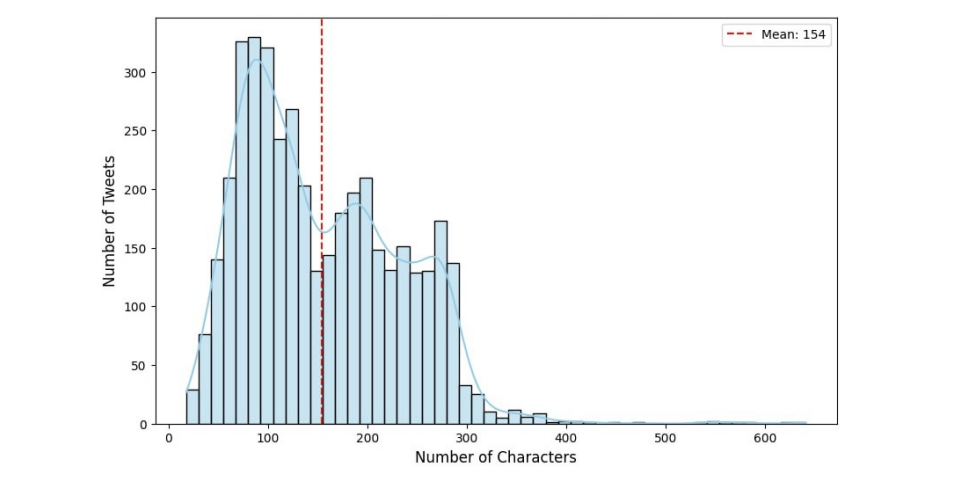

> **Data Quality & Pre-Preprocessing Note:** This analysis reflects the **raw dataset prior to text cleaning and tokenization**. The TWEET-FID dataset is of exceptional quality, having been annotated by multiple crowdsource workers and rigorously cross-checked by food safety experts to ensure high label accuracy.

- **Dataset Scope:** Analyzed 4,122 expert-verified raw tweets directly post-ingestion.
- **Key Observation:** Exhibits a natural tweet character distribution with a mean length of 154 characters and a peak near standard Twitter limits.
- **Engineering Purpose:** Understanding this raw baseline directly guided our text-cleaning pipeline and informed the selection of the optimal `max_length` parameter for fine-tuning **BERTweet**, preventing context loss while preserving GPU efficiency.

### Class Label Distribution & Balance Verification
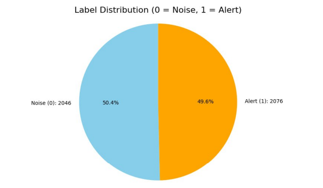

- **Class Breakdown:** 2,076 **Alert** tweets (Label 1) vs. 2,046 **Noise** tweets (Label 0).
- **Dataset Balance:** Highly balanced distribution (~50/50 split across binary categories).
- **Engineering Purpose:** Confirms dataset equilibrium, ensuring the classification model trains without class bias or requiring artificial resampling/reweighting techniques.

- ### Named Entity Co-occurrence Matrix
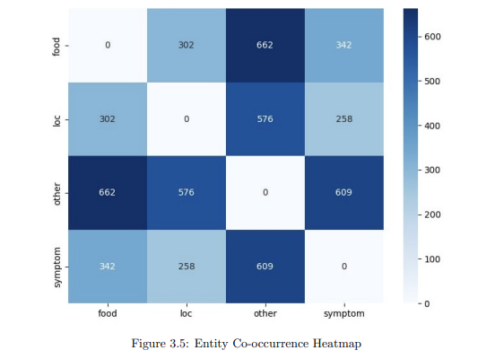

- **Semantic Richness:** Evaluates joint entity occurrences (`food`, `loc`, `symptom`, `other`) within individual tweets for Named Entity Recognition (NER) pipeline design.
- **Key Observation:** High co-occurrence values between `symptom` and `food` (342 co-occurrences) as well as `symptom` and `loc` (258 co-occurrences).
- **Domain Relevance:** Validates that "Alert" signals represent granular, context-rich public health reports linking specific symptoms to distinct food items and locations, rather than generic slang.

## ## Exploratory Data Analysis (EDA) — Raw Data Insights (SemEval-2025 Task 9 Data)

### Data Quality & Missing Value Audit
- **Data Integrity:** 0% missing values detected across all attributes, ensuring consistent baseline records.
- **Deduplication:** Only 18 duplicate rows identified, confirming negligible repetition risk without distorting the overall distribution.
- **Multilingual & Symbol Heterogeneity:** Identified 4,985 texts and 1,950 titles containing non-ASCII symbols and irregular character usage, reflecting the multilingual nature of the dataset.

### Structural Text & Title Length Distribution
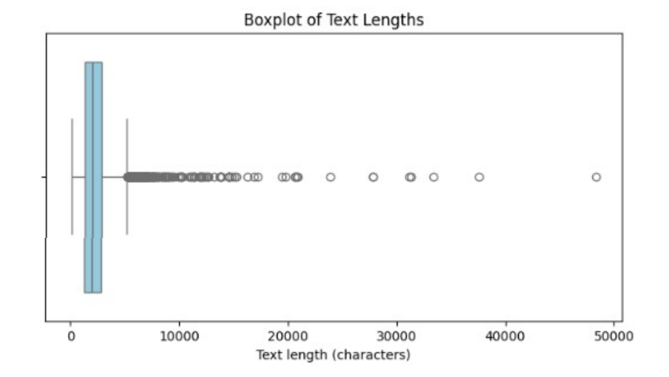

- **Document Text Length Analysis :**
  - **Median Length:** 1,946 characters (Broad spread with $\text{IQR} = 1560.5$).
  - **Outlier Detection:** 202 unusually long document texts identified as upper outliers; no short-text anomalies or empty fields found.
- **Title Length Analysis :**
  - **Median Length:** 86 characters.
  - **Outlier Detection:** 9 exceptionally short titles and 122 exceptionally long titles detected, with zero missing values.
- **Engineering Value:** Validated structural stability and text boundaries for long-sequence inputs, guiding tokenization truncation thresholds and text-cleaning pipelines.

### Temporal Distribution Analysis
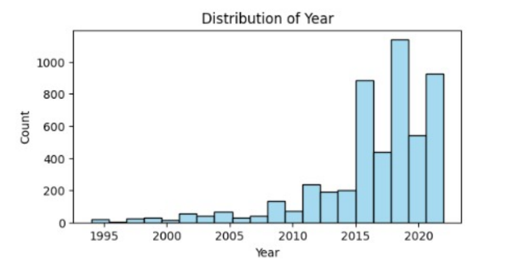

- **Temporal Trend :** Shows an uneven temporal distribution spanning from 1994 to recent years.
  - **Early Baseline (1994–2005):** Sparse reporting density during early digital surveillance years.
  - **Growth & Surge (Post-2009 & Post-2012):** A sharp increase in volume starting after 2009, with significant activity peaks reaching up to 568 reports in specific peak years (e.g., 2016).
- **Domain Interpretation:** The upward trajectory reflects systemic improvements in digitized reporting infrastructure and heightened regulatory surveillance over time, rather than an organic increase in actual foodborne illness incidents.

### Geographical Report Distribution
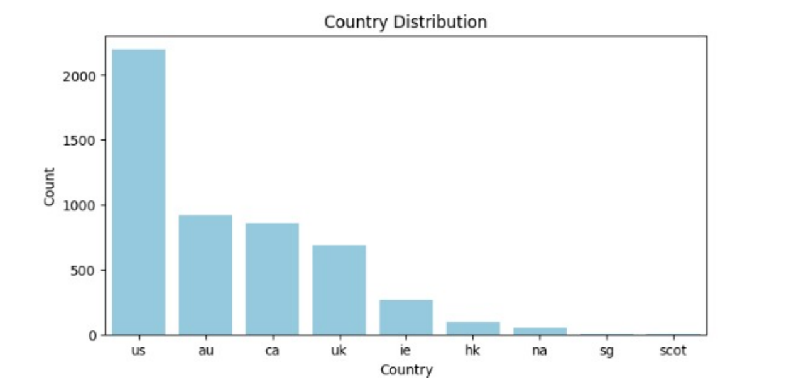

- **Regional Breakdown :** Reporting volume is concentrated across key Anglophone public health jurisdictions:
  - **United States (`us`):** 2,195 reports (Primary contributor)
  - **Australia (`au`):** 921 reports
  - **Canada (`ca`):** 856 reports
  - **United Kingdom (`uk`):** 687 reports
- **Geographic Representation:** Demonstrates regional dominance in public health logging, informing regional risk-normalization strategies when modeling international outbreak trends.

### Product Category Distribution Analysis
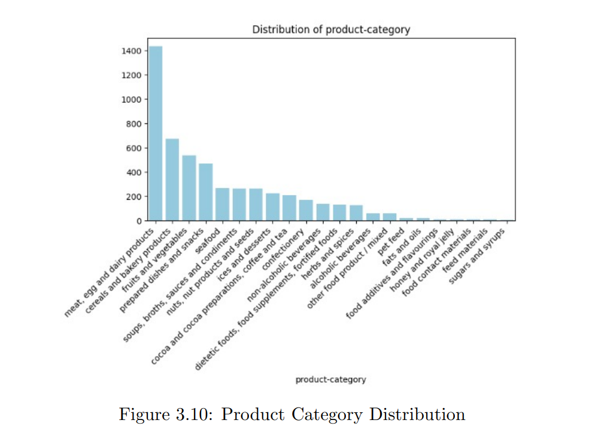

- **Category Breadth :** Covers **22 distinct product categories**, demonstrating comprehensive monitoring across food types.
- **Primary Contributor Breakdown:**
  - **Meat, Egg, and Dairy Products:** $28.2\%$ (Largest share)
  - **Cereals and Bakery Products:** $13.2\%$
  - **Fruits and Vegetables:** $10.5\%$
  - **Prepared Dishes and Snacks:** $9.2\%$
  - **Low-Risk Categories:** Items like sugars and syrups each contribute less than $1\%$.
- **Regulatory Alignment:** Reflects highly targeted surveillance focused on high-risk, perishable, and animal-derived food groups susceptible to microbial contamination.

### Granular Product Specificity Analysis
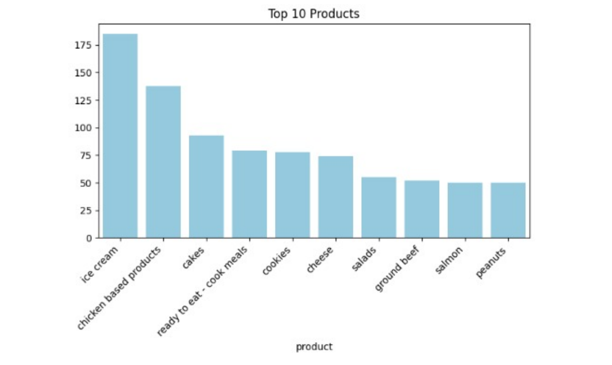

- **Product Diversity :** Identifies **1,022 unique product names**, demonstrating extremely high specificity in public health incident logging.
- **Frequent High-Risk Specific Products:**
  - **Ice Cream:** 185 instances
  - **Chicken-based Products:** 138 instances
  - Followed by cakes, ready-to-eat meals, cookies, cheese, salads, ground beef, salmon, and peanuts.
- **Long-Tail Distribution:** While high-risk specific items recur frequently, the vast majority of unique products appear only once, emphasizing the necessity of robust NLP entity-extraction pipelines capable of handling rare and unseen vocabulary.

### Hazard Type & Allergen Risk Analysis
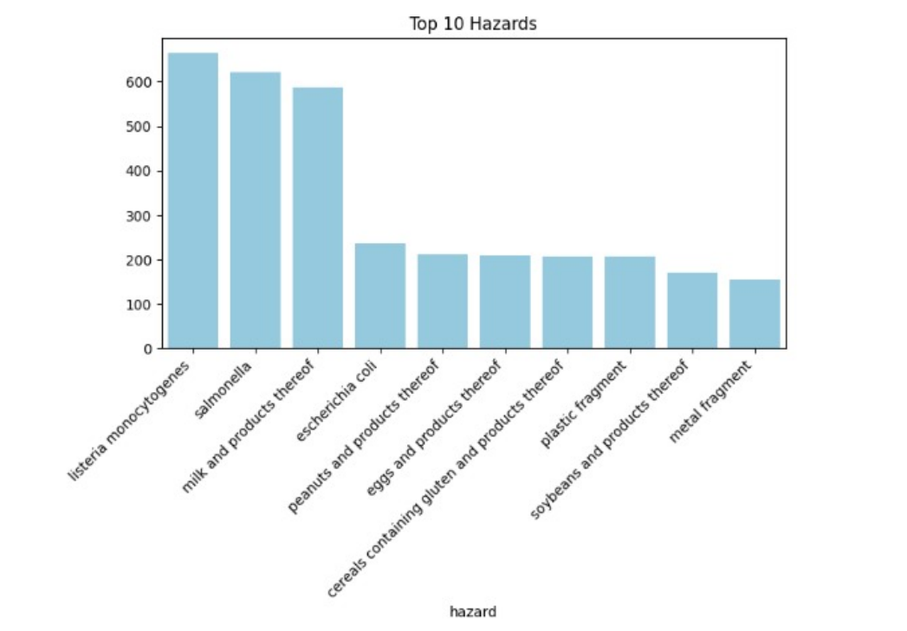

- **Hazard Diversity (Figure 3.12):** Encompasses **128 unique hazard types**, providing comprehensive coverage across biological, chemical, and physical food safety threats.
- **Dominant Pathogens & Allergenic Hazards:**
  - **Listeria monocytogenes:** $13\%$ of total recorded hazards
  - **Salmonella:** $12.2\%$
  - **Milk and Products Thereof (Allergen):** $11.6\%$
  - **Moderate Frequency Risks:** *Escherichia coli*, peanut allergens, gluten/wheat allergens, plastic fragments, soy, and metal fragments.
- **Long-Tail Pattern:** A heavy concentration in primary biological pathogens and top-tier allergens, with a long tail of minor physical contaminants appearing only once or twice.

---

## ## Exploratory Data Analysis (EDA) — Raw Data Insights (FDA Data)
### Raw openFDA API Record Structure

- **Data Origin & Ingestion :** Highlights raw recall, product, and location records fetched directly via the **openFDA Food Enforcement API** prior to text normalization or schema restructuring.
- **Structural Attributes:** Retains original API JSON/record key-value mappings covering essential regulatory metadata:
  - **Recall-Related:** `recall_number`, `reason_for_recall`, `status`, `classification`.
  - **Product-Related:** `product_description`, `code_info`.
  - **Location & Entity Metadata:** `recalling_firm`, `city`, `state`, `country`.
- **Engineering Value:** Validates the raw API payload schema, informing the automated ingestion pipeline, field selection, and preprocessing parser designed to format heterogeneous government records for downstream analysis.

### Monthly Recall Activity Trend Analysis
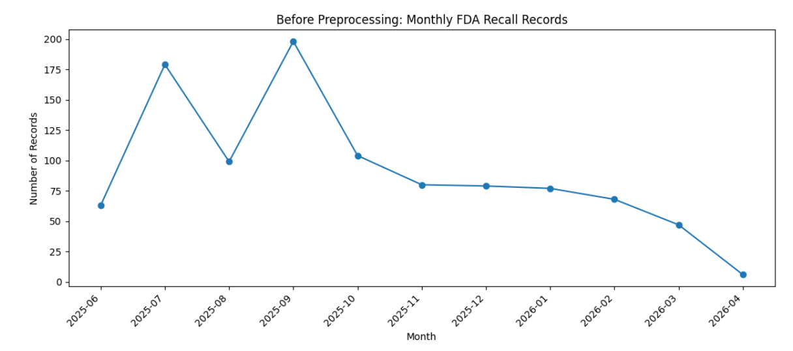

- **Temporal Trend :** Demonstrates the monthly fluctuations and longitudinal reporting volume of FDA food recall events.
- **Pattern Identification:** Reveals noticeable seasonality and irregular reporting spikes across different months rather than an even temporal spread.
- **Domain & Engineering Insight:** Identifying these longitudinal patterns provides crucial context for time-series aggregation, enabling the evaluation of regulatory enforcement cycles and potential seasonal outbreak surges.
- 

### Recall Case Status Distribution
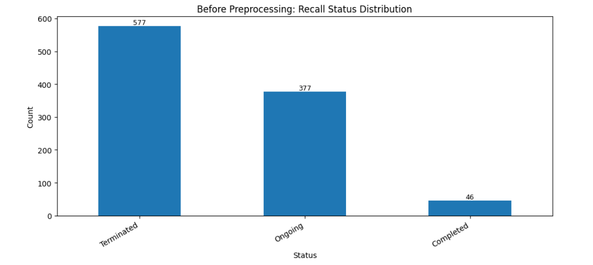

- **Status Breakdown :** Illustrates the operational state of extracted FDA recall cases prior to data preprocessing:
  - **Terminated:** 577 records (Majority of recall cases officially resolved and closed).
  - **Ongoing:** 377 records (Active recall actions undergoing regulatory processing).
  - **Completed:** 46 records (Recalls where all actions are finished but final administrative termination is pending).
- **Engineering Value:** Categorizes the active context of enforcement data, enabling label filtering and status-based feature engineering during data modeling.

### Text Length Variability Analysis (Pre-Preprocessing)
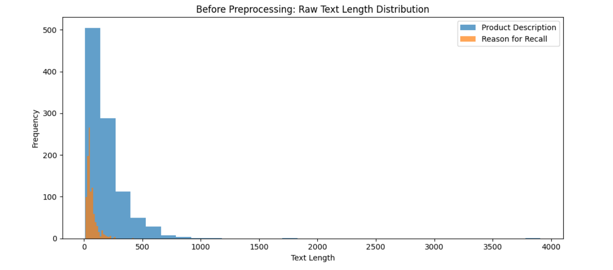

- **Text Length Comparison :** Evaluates length distributions for core textual fields (`product_description` vs. `reason_for_recall`):
  - **`product_description`:** Exhibits higher variability and longer lengths, with extreme right-skewed outliers (up to ~4,000 characters) due to detailed batch codes and embedded product specifications.
  - **`reason_for_recall`:** Displays a significantly narrower text-length range, remaining concise and concentrated near lower character bounds.
- **Engineering Value:** Evaluates sequence length variability before text concatenation, establishing context-length baselines to prevent truncation of critical entity identifiers in the classification transformer model.

### Missing Value Audit (Pre-Preprocessing)
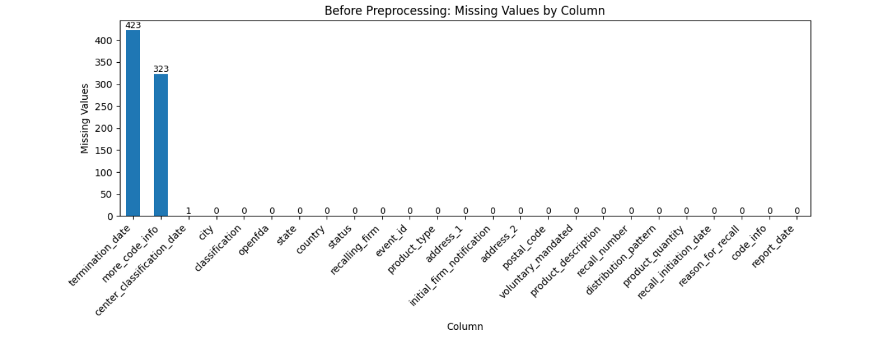

- **Completeness Audit :** Identifies missing value frequencies across all raw API attributes before preprocessing:
  - **Zero Missing Core Attributes:** Essential core fields required for model inputs (`product_description`, `reason_for_recall`, `recall_number`, `classification`, `status`, and `report_date`) contain **$0$ missing values**.
  - **Optional Field Missingness:** Missing data is isolated to optional administrative attributes: `termination_date` ($423$ missing), `more_code_info` ($323$ missing), and `center_classification_date` ($1$ missing).
- **Engineering Value & Preprocessing Rule:** Confirms that data filtering can strictly target records missing mandatory classification text, safely preserving records with missing optional fields without risking training sample size loss.

---

## Exploratory Data Analysis (EDA) — Post-Preprocessing

This phase evaluates the structural cleanliness, text normalization outcomes, and dataset stability across all three datasets following the execution of cleaning and feature engineering pipelines.

---

### 1. TWEET-FID Dataset (Post-Preprocessing)

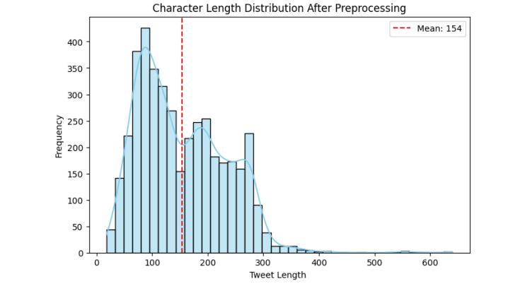

- **Post-Cleaning Structural Stability :** Analyzes character-length metrics across cleaned tweets:
  - **Mean Tweet Length:** Standardized to $\approx 154$ characters after noise reduction.
  - **Distribution Shape:** Preserves a stable multi-modal distribution, demonstrating that web artifacts, URLs, and user mentions were removed without stripping core semantic context or diagnostic text content.
- **Engineering Outcome:** Confirms optimal input length alignment for tokenization without creating empty sequences or artificial character truncations.

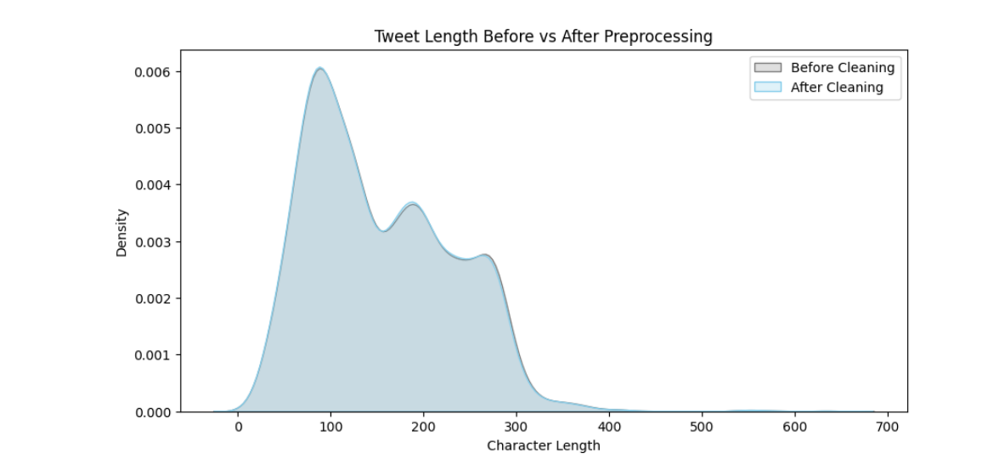

- **Comparative Density Analysis :** Overlays the character length distributions before and after text cleaning:
  - **Noise-Reduction Impact:** Shows a slight downward shift in raw length due to the systematically removed noise elements (URLs, `@user` mentions, special characters).
  - **Distribution Preservation:** The overall density profile perfectly retains its original multi-modal shape.
- **Engineering Value:** Validates that preprocessing successfully isolated and eliminated irrelevant variance while keeping the underlying semantic signal fully intact and highly representative for downstream tokenization and model training.

### 2. SemEval-2025 Task 9 Dataset (Post-Preprocessing)

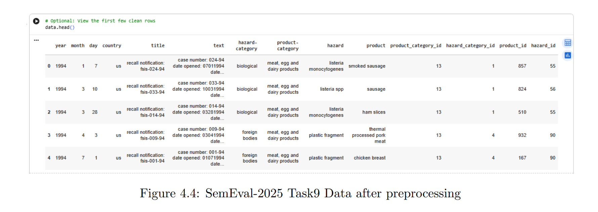

- **Structural Transformer Optimization :** Applied domain-aware cleanup pipelines to standardize text inputs while preserving structural context:
  - **Non-Semantic Noise Reduction:** Stripped HTML artifacts, raw URLs, and generic contact metadata.
  - **Punctuation Protection:** Safely preserved critical punctuation (colons, dashes, scientific symbols) vital for domain-specific hazard codes and chemical identifiers.
- **Key Transformation Highlights:**
  - **Text Consistency:** Executed Unicode character normalization and purged 18 exact duplicate records to protect model optimization from repeating encoding errors.
  - **Objective Readiness & Target Encoding:** Encoded all four target entities into integer ID mappings required for transformer loss computation:
    - High-level categories: `product_category_id`, `hazard_category_id`
    - Micro-level entities: `product_id`, `hazard_id`
- **Imbalance Handling Strategy:** Opted to preserve natural class distributions rather than introducing synthetic noise via oversampling; class imbalance is directly handled using cost-conscious loss weighting during model training.
 ### 3.FDA Dataset (Post-Preprocessing)
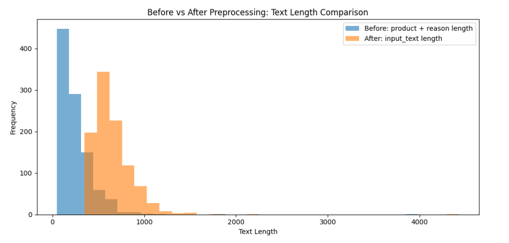

Comparative Text Length Analysis : Compares the text length distribution before and after preprocessing.

Processed Input Characteristics: The processed input text is longer because it combines the generated title and summary.

Classification Impact: Combining these elements makes the FDA records more informative for classification.

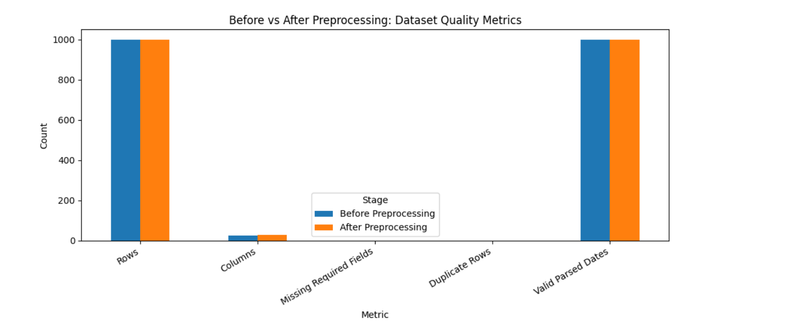
* **Dataset Quality Overview :** Shows dataset quality metrics before and after preprocessing.
* **Data Integrity Preservation:** Total rows and valid dates were completely preserved throughout the pipeline.
* **Feature Pipeline Additions:** New essential fields were created for the final pipeline, including `source`, `title`, `text`, and `input_text`.

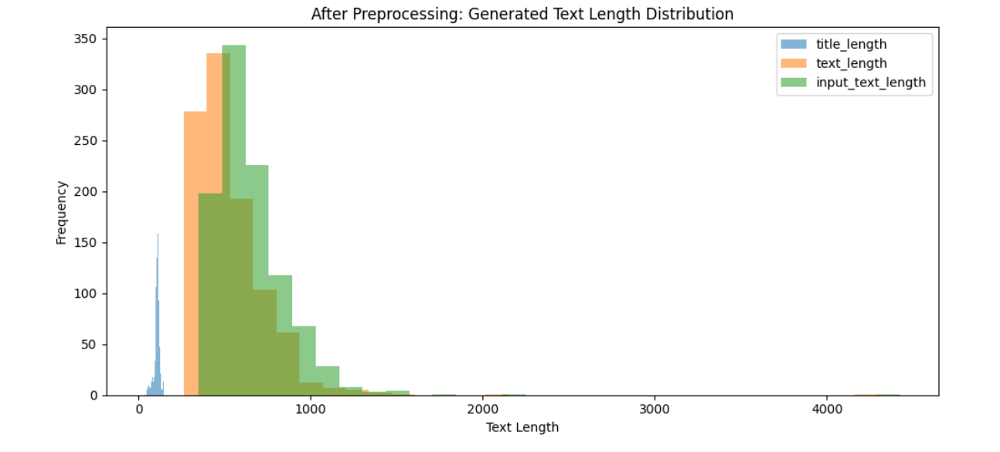

- **Generated Text Length Distribution :** Shows the text length distribution for the generated FDA fields (`title_length`, `text_length`, and `input_text_length`) after preprocessing.
- **Title Conciseness:** The values for `title_length` are distinctly shorter, as the title was specifically designed to serve as a concise recall headline.
- **Text & Input Comparison:** The `text_length` and `input_text_length` distributions cover broader text ranges, providing the necessary context for classification tasks.

# Modeling & System Architecture

This section details the modeling architecture of the food safety monitoring system. It outlines the end-to-end processing pipeline, model selection rationale across tasks, and the integration of machine learning outputs into actionable analytical dashboards.

## System Architecture Overview

* **System Purpose:** Designed to transform unstructured food safety-related textual data into structured analytical outputs to support foodborne illness monitoring and early warning.
* **Data Ingestion & Preprocessing:** Data is collected from social media posts and official food safety alerts. Social media data is cleaned to remove noise, special characters, URLs, and irrelevant tokens, while official FDA records are cleaned and formatted for consistency.
* **Task 1: Alert Detection:** Uses the BERTweet model to classify tweets as real foodborne illness alerts or non-hazard/noisy messages. Non-alerts are filtered out, ensuring only relevant hazard information proceeds.
* **Task 2: Named Entity Recognition (NER):** Uses the BioBERT model on filtered tweets to extract key entities such as food products, hazards, and locations, converting text into structured entity-level information.
* **Task 3: Product Category Classification:** Takes preprocessed official alerts and validated Task 1 tweets to predict food product categories using evaluated models including RoBERTa-large, BERT-CNN-BiLSTM, ModernBERT-Large, and Qwen2.5.
* **Merged Data & Representation:** Combines extracted entities, predicted product categories, and preprocessed information into a unified structured dataset as the foundation for analysis.
* **Visualization & Dashboard:** Displays processed data on an interactive dashboard featuring real-time alert monitoring, geospatial mapping, and pattern anomaly detection to support surveillance and early warning decisions.

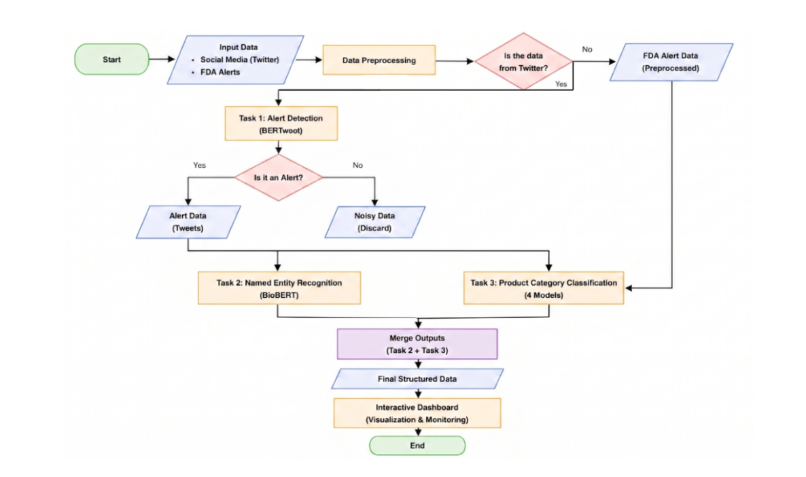

## Model Building & Pipeline Engineering

This section details the design and implementation of separate machine learning pipelines across three core tasks. Each task was developed, tuned, and configured independently using task-specific architectures and optimization strategies.

---

### Task 1: Alert Detection (Binary Classification)

Acts as the primary filtering gate to separate valid food safety alerts from general social media noise.

- **Backbone Architecture:** `BERTweet` (pre-trained on Twitter data for handling informal text).
- **Data Splitting Strategy:** Cleaned tweet text mapped to binary target labels (`alert` / `non-alert`). Stratified split into **70% Train / 10% Validation / 20% Test** using a fixed random seed (`42`).
- **Preprocessing & Tokenization:** Tokenized via `AutoTokenizer` with normalization, sequence truncation, and max padding set to `128` tokens.
- **Training Setup & Optimization:** Fine-tuned using Hugging Face `Trainer` API with standard Cross-Entropy Loss.
- **Hyperparameter Search Space (Random Search - 5 Trials):**
  - **Learning Rate:** `[1e-5, 2e-5, 3e-5, 5e-5]`
  - **Batch Size:** `[8, 16, 32]`
  - **Epochs:** `[3, 5, 10]` | **Weight Decay:** `[0.0, 0.01, 0.1]`
- **Regularization & Early Stopping:** Evaluated at each epoch; best checkpoint selected via validation F1-score with early stopping (`patience=2`).
- **Explainability Integration:** Integrated **LIME** post-testing to analyze word-level feature contributions driving binary decision boundaries.
- **Tech Stack:** Python, PyTorch, Hugging Face `Transformers`, `scikit-learn`, `LIME`, `Matplotlib`.

---

### Task 2: Named Entity Recognition (Token-Level Sequence Labeling)

Extracts domain-specific entities (`food`, `symptom`, `location`) from validated alert tweets using the BIO tagging scheme (`O`, `B-food`, `I-food`, `B-symptom`, `I-symptom`, `B-loc`, `I-loc`).

- **Backbone Architecture:** `BioBERT` (pre-trained on biomedical corpora for domain-specific terminology).
- **Data Refinement & Splitting:**
  - Standardized entity tags to the predefined 7-label BIO set; unmapped entities set to `O`.
  - Applied rule-based term dictionaries to enrich token-level annotations.
  - Split dataset into **70% Train / 10% Validation / 20% Test** (Seed: `42`).
  - **Class Rebalancing:** Upsampled entity-bearing training rows to mitigate `O`-label dominance.
- **Subword Alignment & Padding:** Handled transformer subword tokenization by aligning original word tokens to subwords while ignoring subword loss tokens. Max length set to `128` tokens.
- **Hyperparameter Search Space (Random Search - 8 Trials):**
  - **Learning Rate:** `[1e-5, 2e-5, 3e-5]`
  - **Epochs:** `[3, 5, 7, 10]` | **Weight Decay:** `[0.0, 0.01, 0.1]` | **Batch Size:** `8`
- **Regularization:** Checkpoint selection guided by top Validation F1-score with early stopping (`patience=2`).
- **Tech Stack:** Python, PyTorch, Hugging Face (`AutoModelForTokenClassification`, `DataCollatorForTokenClassification`), `seqeval`, `Pandas`.

---

### Task 3: Product Category Classification (Multi-Class Classification)

Categorizes incidents into standardized food product categories by benchmarking multiple transformer and hybrid architectures.

- **Evaluated Architectures:** `RoBERTa-large`, `ModernBERT-base`, `Qwen2.5-0.5B`, and `BERT-CNN-BiLSTM`.
- **Data Strategy & Rebalancing:**
  - Feature Engineering: Combined `title` and `text` into a single sequence input field.
  - Pruned rare categories with fewer than 10 instances; encoded remaining labels into numeric format.
  - Split into **70% Train / 10% Validation / 20% Test** (Seed: `42`).
  - **Loss Reweighting:** Computed class weights from training set to penalize class imbalance within Cross-Entropy Loss.
- **Hyperparameter Search Space (Random Search - 8 Trials per Model):**
  - **Learning Rate:** `[1e-5, 2e-5, 3e-5]`
  - **Batch Size:** `[2, 4]`
  - **Epochs:** `[3, 5, 8, 10]` | **Weight Decay:** `[0.0, 0.01, 0.1]`
- **Model Tuning Protocol:** Standardized training setup across candidate models; selected optimal checkpoints based on Validation Macro F1-score (`patience=2`).
- **Explainability Integration:** Applied **LIME** to misclassified instances to visualize word influence on category selection.
- **Tech Stack:** Python, PyTorch, Hugging Face `Transformers`, `scikit-learn`, `LIME`, `NumPy`.

## Development Environment & Infrastructure

The model development and training pipeline was implemented using cloud-based GPU infrastructure to support efficient fine-tuning of transformer architectures.

- **Computational Environment:** Developed and executed on **Google Colab**, utilizing cloud-hosted GPU resources for accelerated deep learning experimentation and model tuning.
- **Core Frameworks & Libraries:** Built primarily in **Python**, leveraging **PyTorch** and the **Hugging Face Transformers** ecosystem for downloading pre-trained models, tokenization, fine-tuning, sequence evaluation, and model serialization.
- **Storage & Artifact Management:** Integrated with **Google Drive** for persistent storage of dataset versions, experimental checkpoints, evaluation logs, and finalized model artifacts.
- **Deployment Readiness:** Trained and fine-tuned model checkpoints were serialized and structured for seamless downstream integration into the interactive dashboard.

## Model Evaluation & Experimental Results

To rigorously assess model performance, a multifaceted evaluation strategy was applied using standard classification metrics across all tasks. Hyperparameter tuning was conducted using Random Search to optimize learning rate, batch size, weight decay, and training epochs.

---

### Task 1: Alert Detection Performance (BERTweet)

The optimal configuration identified via random search consisted of: `learning rate = 1e-5`, `batch size = 8`, `weight decay = 0.01`, and `epochs = 10`.

#### BERTweet Fine-Tuning Performance
| Setting | Accuracy | Precision | Recall | F1-Score |
| :--- | :---: | :---: | :---: | :---: |
| **Before Tuning** | 0.8545 | 0.8271 | 0.8993 | 0.8617 |
| **After Tuning** | 0.8534 | 0.8819 | 0.8187 | 0.8491 |

- **Optimization Impact:** Tuning elevated precision from `0.8271` to `0.8819`, significantly reducing false positive alerts—a key requirement for real-time hazard monitoring.
- **Confusion Matrix Breakdown (Post-Tuning):**
  - **Noise Class:** 391 correctly classified, 49 false positives.
  - **Alert Class:** 366 correctly identified, 81 false negatives.

---

### Task 2: Named Entity Recognition Performance (BioBERT)

The optimal configuration identified consisted of: `learning rate = 3e-5`, `epochs = 7`, and `weight decay = 0.0`.

#### BioBERT NER Performance
| Setting | Precision | Recall | F1-Score | Accuracy |
| :--- | :---: | :---: | :---: | :---: |
| **Before Tuning** | 0.7392 | 0.6814 | 0.7091 | 0.9596 |
| **After Tuning** | 0.7267 | 0.6795 | 0.7023 | 0.9602 |

- **Per-Entity Performance:** Strong extraction accuracy on `symptom` entities (`F1 = 0.81`), with persistent challenges on `food` (`F1 = 0.54`) and `location` (`F1 = 0.50`) due to social media text ambiguity, justifying rule-based dictionary enrichment.

---

### Task 3: Product Category Classification (Model Benchmarking)

Task 3 evaluated four candidate architectures for multi-class product classification after hyperparameter tuning.

#### Benchmark Model Comparison (Post-Tuning)
| Model | Macro Accuracy | Macro Precision | Macro Recall | Macro F1 |
| :--- | :---: | :---: | :---: | :---: |
| **ModernBERT-Large** | **0.8170** | **0.7757** | **0.7183** | **0.7401** |
| **RoBERTa-large** | 0.8117 | 0.7595 | 0.7327 | 0.7384 |
| **Qwen2.5** | 0.8049 | 0.7609 | 0.7088 | 0.7242 |
| **BERT-CNN-BiLSTM** | 0.8018 | 0.7348 | 0.7035 | 0.7095 |

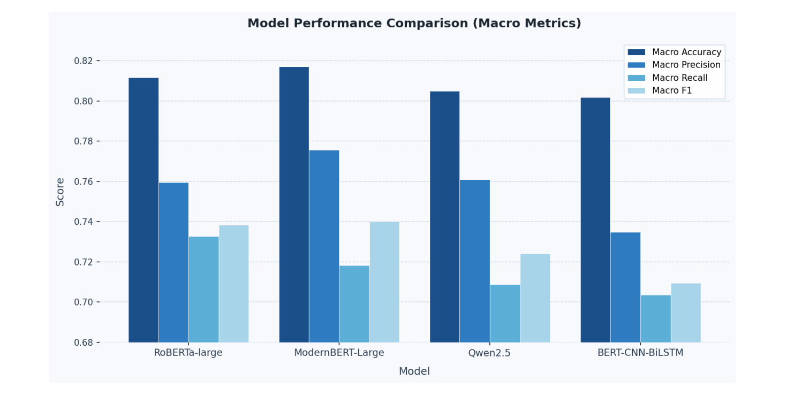

- **Comparative Key Findings:** 
  - **ModernBERT-Large** achieved the top overall performance with a **Macro F1 of 0.7401** and **Macro Accuracy of 0.8170**.
  - **RoBERTa-large** followed closely (`Macro F1 = 0.7384`), showcasing deep 24-layer contextual representations.
  - Pure transformer architectures consistently outperformed the hybrid **BERT-CNN-BiLSTM** baseline (`Macro F1 = 0.7095`).
 
- ### Model Transparency & Explainability (LIME Analysis)

To interpret model decision boundaries and diagnose failure cases, Local Interpretable Model-agnostic Explanations (LIME) was applied to analyze prediction behavior.

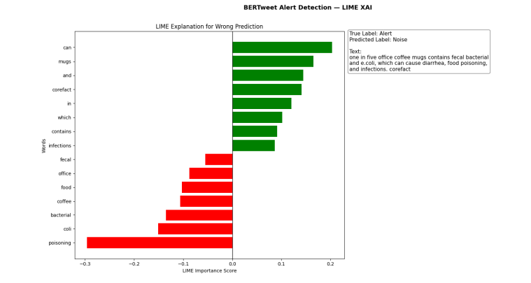

#### Error Case Analysis (False Negative Analysis)
- **Sample Instance:** *"one in five office coffee mugs contains fecal bacterial and e.coli, which can cause diarrhea, food poisoning, and infections. corefact"*
- **Ground Truth:** `Alert` | **Predicted:** `Noise`
- **Key LIME Findings:**
  - **Positive Contribution to Noise:** Generic and contextual tokens (`can`, `mugs`, `and`, `corefact`, `in`, `which`, `contains`, `infections`) incorrectly drove the prediction toward the `Noise` label.
  - **Negative Contribution to Alert:** Strong microbiological and health indicators (`poisoning`, `coli`, `bacterial`, `food`, `coffee`, `fecal`) pushed away from the correct `Alert` classification.
- **Root Cause Insight:** Highlights a pre-training limitation where BERTweet occasionally maps clinical terminology in informal, trivia-style contexts to non-alert social chatter, suppressing true signals.

#### Token-Level NER Error Case Analysis (BioBERT)

To analyze sub-word and token-level sequence labeling behavior, LIME was applied to inspect misclassified entities within Task 2.

#### Token-Level NER Error Case Analysis (BioBERT)

To analyze sub-word and token-level sequence labeling behavior, LIME was applied to inspect misclassified entities within Task 2.

- **Target Token:** `food`
- **Sample Instance:** *"Came to a conclusion that I had freakin food poison ; )"
- **Ground Truth:** `B-food` | **Predicted:** `O`
- **Key LIME Findings:**
  - **Over-Anchoring on Clinical Cues:** The token `poison` heavily dominates with an extreme positive importance score (~`+0.40`), strongly driving the token-level prediction toward the non-entity `O`.
  - **Negative Importance on Target Entity:** The target token `food` receives the largest negative score (~`-0.30`), actively opposing its correct `B-food` .
  - **Context Tokens:** Auxiliary words (`to`, `freakin`, `a`, `I`, `Came`) contribute minor positive weights to `O`, while `had` and `conclusion` reinforce the misclassification to a lesser degree.
- **Root Cause Insight:** Demonstrates that BioBERT's biomedical pre-training causes it to anchor excessively on isolated clinical terms like `poison`, overshadowing colloquial food entity contexts in informal social media phrasing.

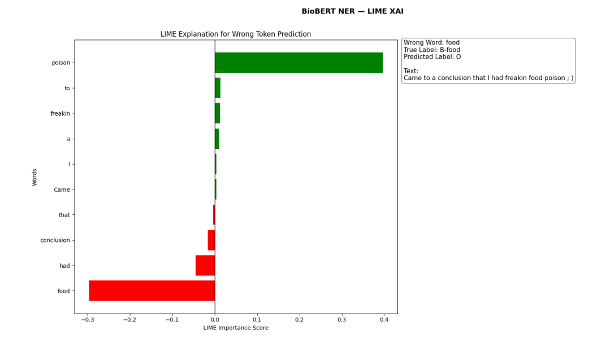
